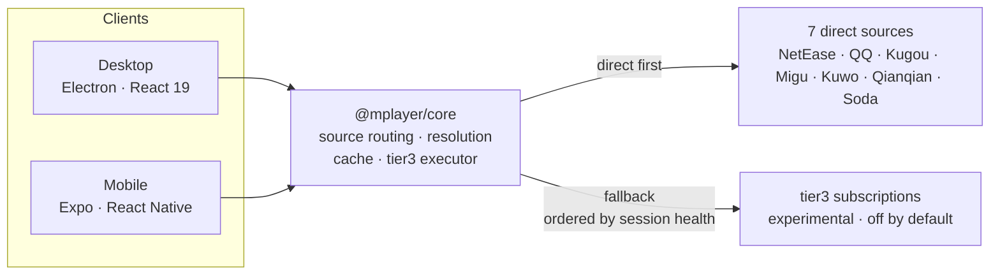
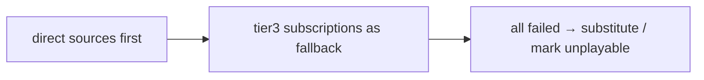

<div align="center">


# MPlayer

**A cross-platform music player that talks to seven music sources directly**

Electron desktop · Expo / React Native mobile · one shared `@mplayer/core`

[](https://github.com/fuzz1og/mplayer/actions/workflows/ci.yml)
[](https://github.com/fuzz1og/mplayer/actions/workflows/release.yml)
[](https://github.com/fuzz1og/mplayer/releases)
[](LICENSE)
[](https://github.com/fuzz1og/mplayer/stargazers)

<sub>English · <a href="README.md">简体中文</a></sub>

</div>

> [!NOTE]
> A personal learning project, built to study the Electron / React / React Native / TypeScript stack. No commercial intent.

---

<details>
<summary><b>Contents</b></summary>

- [Download](#-download)
- [Features](#-features)
- [Screenshots](#-screenshots)
- [Quick start](#-quick-start)
- [Architecture](#-architecture)
- [Desktop features](#-desktop-features)
- [Mobile features](#-mobile-features)
- [Sources and resolution chain](#-sources-and-resolution-chain)
- [Tech stack](#-tech-stack)
- [Development](#-development)
- [Release](#-release)
- [Credits](#-credits)
- [Disclaimer](#-disclaimer)
- [License](#-license)

</details>

## 📥 Download

Latest builds live on **[Releases](https://github.com/fuzz1og/mplayer/releases/latest)**:

| Platform | Artifact | Notes |
| --- | --- | --- |
| Windows | `MPlayer-Setup-<version>.exe` · `MPlayer-<version>.exe` | NSIS installer / portable |
| macOS | `MPlayer-<version>.dmg` · `MPlayer-<version>-arm64.dmg` | Intel / Apple Silicon |
| Linux | `MPlayer-<version>.AppImage` · `mplayer_<version>_amd64.deb` | x64 |
| Android | `MPlayer-v<version>.apk` · `MPlayer-v<version>.aab` | `.apk` for sideloading, `.aab` for stores |

The desktop app updates itself: GitHub first, falling back to mirrors (gh-proxy / ghfast / ghproxy).

## ✨ Features

**Playback and source switching**

- **🎧 Multi-source playback** — seven sources over their official APIs, with playability probing and a prefetch cache so playback starts with no wait; when a direct source fails, the resolver falls back to third-party sources from your subscription list, ordered by **in-session health** (order changes, the candidate set does not)
- **🔀 Per-track source switching** — full-version preference, playability probing and in-place replacement: swap a dead source with one click
- **⏭️ Skip on failure** — one retry per track, then skip; three unplayable tracks in a row pause playback; offline pauses immediately without entering the resolution chain (both apps let you turn this off)
- **🧭 Diagnosable failures** — failures are reported by cause, with the exact same wording on both platforms ([six causes](#six-failure-causes))

**Both platforms**

- **📱 Feature parity** — desktop (Electron + React) and mobile (Expo + React Native) share core, so behaviour and data semantics line up
- **🔒 Background playback and lock-screen controls** — on Android a hand-written Kotlin module (media3 ExoPlayer owning the queue, native progression, `MediaLibraryService` media session) keeps playback alive and mirrors track changes to the notification and lock screen; iOS falls back to expo-audio
- **🌗 Dark mode** — a dual-theme token system plus `textVariants` on mobile, following the system or switched manually
- **⚡ Smart updates** — the desktop updater prefers GitHub and falls back to mirrors (gh-proxy / ghfast / ghproxy)

**Diagnostics and local files**

- **🩺 Playback diagnostics** — a structured trace of the resolution chain (hit layer, per-stage timings, per-source outcome, guard verdict) kept in an in-memory ring buffer, viewable and exportable as JSON from both settings pages
- **📻 Local music** — ID3 metadata parsing, folder scanning and watching, a download queue (with `.lrc` sidecar lyrics)

## 📸 Screenshots

### Desktop (Electron)

<p align="center">
  
</p>

<p align="center">
  
  
  
</p>

### Mobile (Expo / React Native)

<p align="center">
  
  
  
  
</p>

## 🚀 Quick start

### Desktop (Electron)

```bash
npm install
npm run electron:dev        # dev mode
npm run electron:build      # package for the current platform
```

### Mobile (Expo)

```bash
npm run core:build          # (1) build the shared package first - required on mobile
cd packages/mobile
npm install
npm run start               # (2) start the Expo dev server
```

> [!IMPORTANT]
> Mobile consumes `packages/core/dist`: after touching `packages/core` you must run `npm run core:build` from the repo root, otherwise mobile keeps running the old code.

## 🧭 Architecture



- **Desktop** (`src/`): `contextIsolation: true` + `nodeIntegration: false` (`sandbox: false`); the renderer talks over the preload bridge `window.electronAPI` and has no Node access. Main process (entry / preload / cache / storage / ipc / services / tray) and renderer (lazy router, Zustand, Howler, Ant Design 6) are documented in [docs/agents/architecture.md](docs/agents/architecture.md).
- **Mobile** (`packages/mobile/`): expo-router Stack + Tabs, Zustand (AsyncStorage persist), dual-theme tokens + textVariants. The playback engine is a hand-written Kotlin Expo Module (`modules/native-player/`, media3 ExoPlayer owning the queue + native progression + `MediaLibraryService`) on Android, falling back to expo-audio on iOS.
- **Shared** (`packages/core/`): `api/` direct clients per source, the cache kernel, `shared/` source routing and resolution, the `tier3/` subscription executor, `utils/`.

## 💻 Desktop features

| Area | What it does |
| --- | --- |
| Playback | Multi-source search, hot charts, three play modes (repeat one / repeat all / shuffle), play next, lyrics, global shortcuts, cover-version detection, skip-on-failure (on by default, can be turned off) |
| Source switching | Per-track switching (full-version preference + playability probing + in-place replacement) |
| Search | Songs / artists tabs, artist browsing and detail, strict-match backfill for songs without a URL |
| Favourites / history | Automatic URL refresh written back to the DB; auto-recorded, viewable and clearable |
| Playlists | Create / delete, drag-and-drop ordering, batch operations (create a playlist in place), filter by title / artist, import from text or links |
| Discover | Recommendations / charts / new releases / playlists / artists, album pages, one-click save (charts can save everything into a new playlist) |
| Cache | Prefetch cache (instant playback), cover and audio disk cache, stats and clearing |
| Network | Direct-status panel for all 7 sources, tier3 subscriptions with per-source stats (delivered / discarded / missed / skipped / guard-rejected / health), diagnostic export, HTTP proxy, TLS fingerprint spoofing |
| Download / local | Single and batch downloads with progress; folder scanning, ID3 parsing, change watching |

## 📱 Mobile features

- **Four bottom tabs**: Recommend / Discover / Playlists / Local (Recommend by default; search lives in the top bar rather than a tab)
- **Full-screen player**: swipe left for lyrics, play modes, favourites, queue, play next
- **Playlists**: batch select and batch actions, create-and-add in place, export a discovered playlist to a local playlist with one click
- **Dark mode**: follow system / light / dark
- **Downloads**: saved to the public Downloads folder via SAF
- **Settings**: direct-source settings (auto / direct per source), tier3 subscriptions with per-source stats (including health), update check, cache, playback log, playback diagnostics
- **Detail pages**: charts / playlists / albums / artists / discovered playlists

The full route table lives in [docs/agents/architecture.md](docs/agents/architecture.md) (agent-facing) and the `packages/mobile/app/` directory.

## 🔌 Sources and resolution chain

The self-hosted API has been retired — **no API address to configure**.



- All 7 sources ship a direct official client (NetEase weapi / QQ musicu.fcg / Kugou / Migu / Kuwo / Qianqian / Soda)
- Probing means direct playability: the probe resolves the URL and writes it into the prefetch cache, so playback hits it with no wait
- tier3 subscriptions (experimental, off by default): add a URL / local file / pasted JSON manifest in settings and inspect per-source stats (delivered / discarded / missed / skipped / guard-rejected / health); the resolver orders candidates by **in-session health** — it only changes traversal order, never removes or disables a source: two consecutive failures sink a source, one success brings it back

### Six failure causes

When neither direct sources nor tier3 produce a playable URL, core `explainPlaybackFailure` derives the cause from the **current configuration** (not from cumulative session counters), with the same wording on both platforms:

| Cause | Trigger | What you can do |
| --- | --- | --- |
| tier3 off | Direct sources failed and the third-party master switch is off | Turn it on in settings and retry |
| Direct-only source | This source is set to "direct only", so fallback is deliberately disabled | Switch the source back to "auto" |
| No subscriptions | tier3 is on but no manifest has been added | Add a JSON source manifest |
| No declared source | You have subscriptions, but no source declares support for this track's origin | Add a matching `source` entry / a generic search-then-resolve source |
| All skipped | Sources exist, but every one was skipped by `source` ownership | Check the `source` values in the manifest |
| All applicable sources missed | Every applicable source was tried and missed or timed out | Retry later / change subscriptions |

## 🧱 Tech stack

| Side | Stack |
| --- | --- |
| Desktop | Electron 41 · React 19 · TypeScript · Vite 7 · Zustand · Ant Design 6 · Howler · electron-builder · electron-updater |
| Mobile | Expo 57 · React Native 0.86 · expo-router · media3 / ExoPlayer (hand-written Kotlin playback module) · expo-audio (iOS fallback) · Zustand · AsyncStorage · lucide-react-native |
| Shared | `@mplayer/core`: per-source direct clients, song identification / matching, playback URL resolution, cache kernel, tier3 executor |

## 🔧 Development

```bash
npm run lint                # ESLint (zero warnings)
npm run typecheck           # desktop type check
npm run typecheck:mobile    # mobile type check
npm run test:run            # renderer + top-level src/__tests__ tests
npm run test:main           # main-process tests (node env)
npm run core:build          # build the shared package (required after core changes)
npm run verify              # full pre-commit verification: static checks + four test suites + Expo dependency consistency
                            #   (pass a scope to run one slice); implemented in scripts/verify.mjs
./scripts/verify.sh         # equivalent form (a shim that forwards to scripts/verify.mjs)
```

> [!TIP]
> `scripts/verify.mjs` is the single source of truth for verification order — CI jobs call its slices directly (`check` + four `test` + `expo-check`) instead of re-assembling steps in the workflow.

**Dependency baseline**: versions of `expo` / `expo-*` / `react-native*` / `@react-native-community/*` are decided by the **Expo SDK**, not by "the newest semver allows" — upgrade with `npx expo install --fix` and verify with `npm run verify -- expo` (CI's `expo-check`). The repo keeps exactly **one** copy of `expo` (root and `packages/mobile` must declare the same range); mismatched ranges force a second copy. Rationale and boundaries: [ADR](docs/adr/2026-09-29-dependency-update-governance.md).

- **Desktop E2E (Playwright)**: run `npm run dev` (Vite, 5174) first, then `npx playwright test` (specs in `e2e/`, outside CI and `verify` — a local manual regression tool)
- **Mobile device E2E**: `npm run mobile:e2e` (usbipd-attached device → Metro → cold start → UI walkthrough → play a track, end to end; see [e2e/README.md](e2e/README.md))

## 📦 Release

Pushing a `v*` tag triggers GitHub Actions to build (three desktop platforms + Android APK / AAB) and upload to GitHub Releases; the app can check for updates in place:

```bash
npm run release -- patch     # one-shot release (= ./scripts/release.mjs; verify → bump → commit → push master → tag → trigger CI)
```

## 🙏 Credits

- **[musicdl](https://github.com/CharlesPikachu/musicdl)** (PolyForm Noncommercial License 1.0.0) — reference for how each source's official endpoints, signing algorithms and cookie handling work. This project is an independent TypeScript rewrite, for study and research only, not for commercial use.
- **[NeteaseCloudMusicApi](https://github.com/Binaryify/NeteaseCloudMusicApi)** (MIT) — reference for the NetEase weapi encryption algorithm.

## 📄 Disclaimer

1. A personal learning project; commercial use is not permitted
2. No music files are stored; all media comes from third-party services
3. The built-in rate limiting exists only to reduce request frequency, never to bypass security measures

## 📜 License

[PolyForm Noncommercial License 1.0.0](LICENSE) — **non-commercial use only** (the same licence as the musicdl project it references). Study, research and personal use are permitted; commercial use is not.
