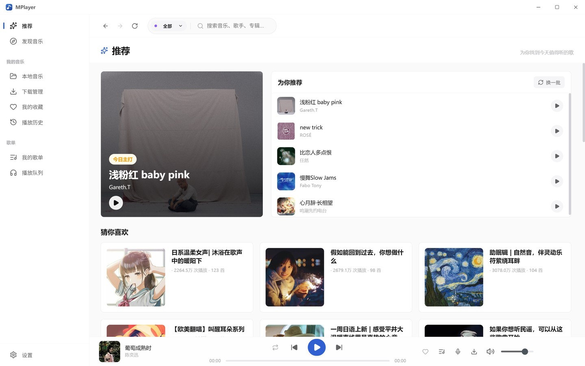
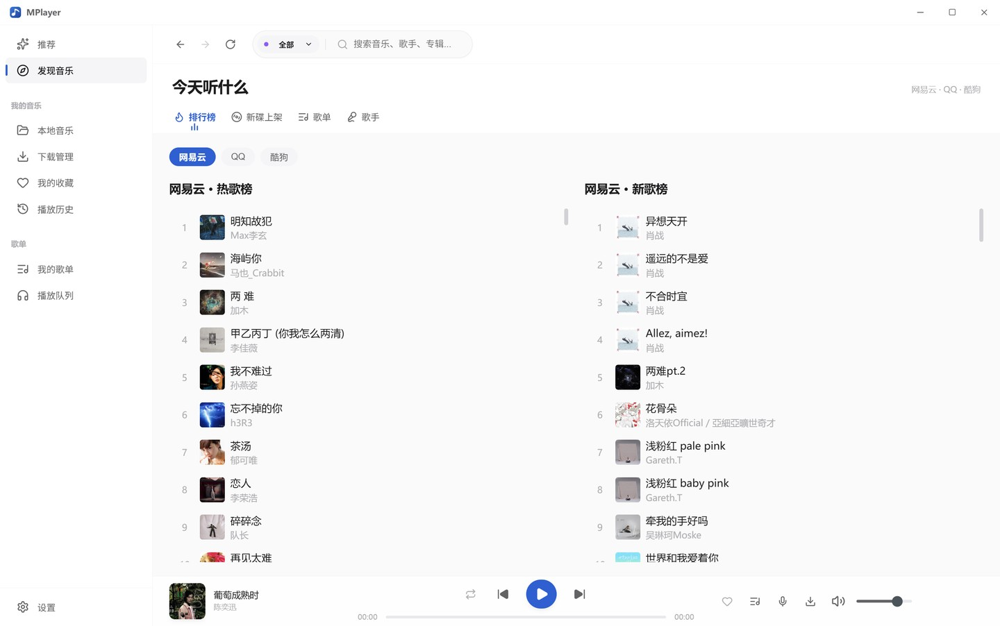
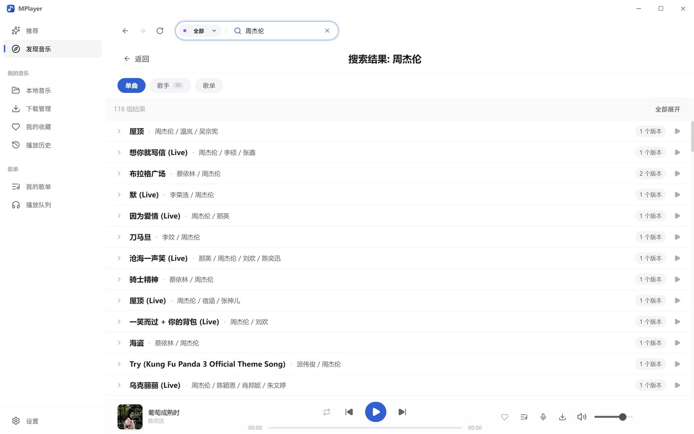
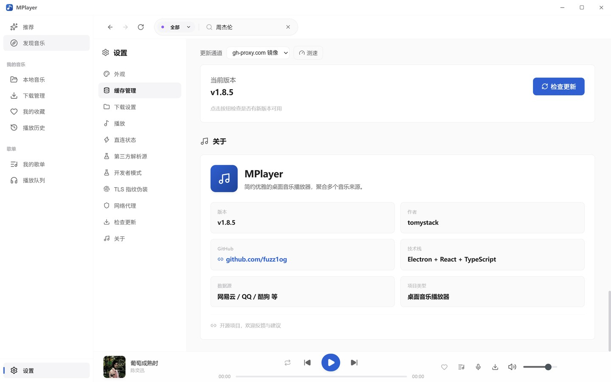
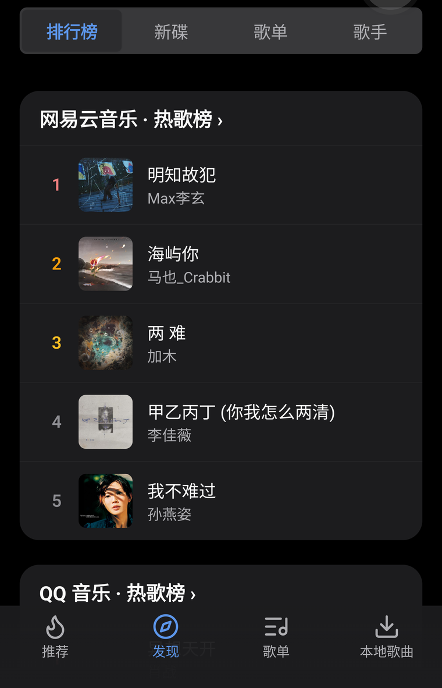
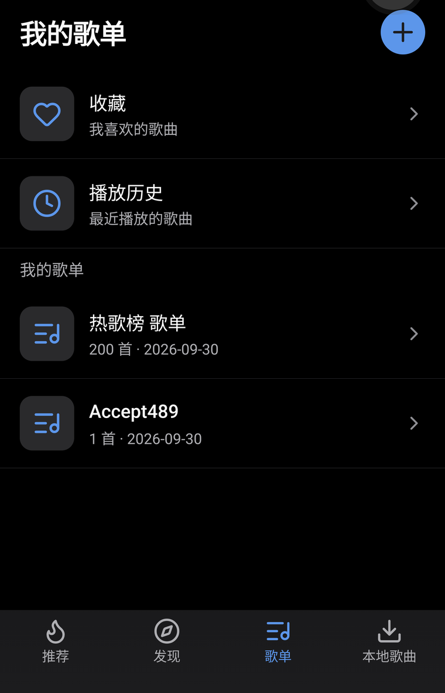
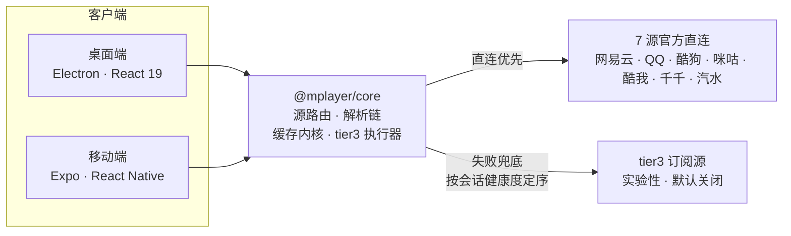

<div align="center">


# MPlayer

**七大音乐源官方直连的跨平台音乐播放器**

桌面 Electron · 移动 Expo / React Native · 双端共享同一套 `@mplayer/core`

[](https://github.com/fuzz1og/mplayer/actions/workflows/ci.yml)
[](https://github.com/fuzz1og/mplayer/actions/workflows/release.yml)
[](https://github.com/fuzz1og/mplayer/releases)
[](LICENSE)
[](https://github.com/fuzz1og/mplayer/stargazers)

<sub><a href="README.en.md">English</a> · 简体中文</sub>

</div>

> [!NOTE]
> 个人学习项目，仅供学习 Electron / React / React Native / TypeScript 技术栈使用，不包含任何商业目的。

---

<details>
<summary><b>目录</b></summary>

- [下载安装](#-下载安装)
- [特性](#-特性)
- [界面预览](#-界面预览)
- [快速开始](#-快速开始)
- [架构总览](#-架构总览)
- [桌面端功能](#-桌面端功能)
- [移动端功能](#-移动端功能)
- [多源与解析链路](#-多源与解析链路)
- [技术栈](#-技术栈)
- [开发](#-开发)
- [发布](#-发布)
- [参考与致谢](#-参考与致谢)
- [免责声明](#-免责声明)
- [许可证](#-许可证)

</details>

## 📥 下载安装

最新版在 **[Releases](https://github.com/fuzz1og/mplayer/releases/latest)**：

| 平台 | 产物 | 说明 |
| --- | --- | --- |
| Windows | `MPlayer-Setup-<version>.exe` · `MPlayer-<version>.exe` | NSIS 安装版 / 免安装版 |
| macOS | `MPlayer-<version>.dmg` · `MPlayer-<version>-arm64.dmg` | Intel / Apple Silicon |
| Linux | `MPlayer-<version>.AppImage` · `mplayer_<version>_amd64.deb` | x64 |
| Android | `MPlayer-v<version>.apk` · `MPlayer-v<version>.aab` | `.apk` 侧载安装，`.aab` 供商店 |

桌面端内置应用内更新：优先 GitHub 直连，失败自动降级到加速镜像（gh-proxy / ghfast / ghproxy）。

## ✨ 特性

**播放与换源**

- **🎧 多源聚合播放** — 7 源官方直连，可播性探测 + 预取缓存，播放零等待出声；直连失败按订阅清单降级到第三方解析源，解析腿按**会话内健康度**定序（只改顺序、不缩减候选集）
- **🔀 单曲换源** — 完整版优先 + 可播性探测 + 原位替换，失效音源一键换源
- **⏭️ 失败即跳** — 同曲重试一次仍失败即跳过，连续 3 首不可播自动暂停；离线直接暂停不进解析链（双端设置页可关）
- **🧭 失败可诊断** — 播放失败按原因分级提示，双端共用同一份文案（[六类归因](#播放失败六类归因)）

**双端体验**

- **📱 双端一致** — 桌面（Electron + React）与移动端（Expo + React Native）共享 core，功能与数据语义对齐
- **🔒 后台播放与锁屏控制** — Android 走自写 Kotlin 模块（media3 ExoPlayer 原生持队列 + 原生推进 + `MediaLibraryService` 媒体会话）：后台保活，通知栏与锁屏控制跟随换曲；iOS 回落 expo-audio
- **🌗 深色模式** — 移动端双主题 token 体系 + textVariants 语义变体，跟随系统或手动切换
- **⚡ 智能更新** — 桌面端更新走 GitHub 直连，失败自动降级到加速镜像（gh-proxy / ghfast / ghproxy）

**诊断与本地**

- **🩺 播放诊断** — 解析链结构化 trace（命中层级 / 各段耗时 / 每源 outcome / 护栏等级）常驻内存环形缓冲，双端设置页查看并一键导出 JSON
- **📻 本地音乐** — ID3 元数据解析、文件夹扫描监视、下载队列（`.lrc` 歌词侧车）

## 📸 界面预览

### 桌面端（Electron）

<p align="center">
  
</p>

<p align="center">
  
  
  
</p>

### 移动端（Expo / React Native）

<p align="center">
  
  
  
  
</p>

## 🚀 快速开始

### 桌面端（Electron）

```bash
npm install
npm run electron:dev        # 开发模式
npm run electron:build      # 打包当前平台
```

### 移动端（Expo）

```bash
npm run core:build          # ① 先构建共享包（移动端必需）
cd packages/mobile
npm install
npm run start               # ② 启动 Expo dev server
```

> [!IMPORTANT]
> 移动端消费的是 `packages/core/dist`：改动 `packages/core` 后必须先在项目根目录跑 `npm run core:build`，否则移动端跑的是旧代码。

## 🧭 架构总览



- **Desktop**（`src/`）：`contextIsolation: true` + `nodeIntegration: false`（`sandbox: false`），渲染层经 preload 桥 `window.electronAPI` 通信、无 Node 能力。主进程（入口 / preload / 缓存 / storage / ipc / services / tray）与渲染进程（懒加载 router、Zustand、Howler、Ant Design 6）详见 [docs/agents/architecture.md](docs/agents/architecture.md)。
- **Mobile**（`packages/mobile/`）：expo-router Stack + Tabs，Zustand（AsyncStorage persist），双主题 token + textVariants。播放引擎 Android 走自写 Kotlin Expo Module `modules/native-player/`（media3 ExoPlayer 持队列 + 原生推进 + `MediaLibraryService`），iOS 回落 expo-audio。
- **Shared**（`packages/core/`）：`api/` 多源直连客户端、cache 内核、`shared/` 源路由与解析、`tier3/` 订阅执行器、`utils/`。

## 💻 桌面端功能

| 分类 | 功能 |
| --- | --- |
| 播放 | 多源搜索、热歌榜、三种播放模式（单曲循环 / 列表循环 / 随机播放）、歌词、全局快捷键、试听版识别提示、失败即跳（默认开，可关） |
| 换源 | 单曲换源（完整版优先 + 可播性探测 + 原位替换） |
| 搜索 | 歌曲 / 歌手 Tab、歌手浏览与详情、无 URL 歌曲严格匹配回填 |
| 收藏 / 历史 | URL 自动刷新与 DB 回写；自动记录、查看 / 清空 |
| 歌单 | 创建 / 删除、拖拽排序、批量操作、文本 / 链接导入 |
| 发现 | 推荐 / 排行榜 / 新碟 / 歌单 / 歌手、专辑页、一键保存 |
| 缓存 | 预取缓存（播放零等待）、封面 / 音频磁盘缓存、统计 / 清除 |
| 网络 | 7 源直连状态面板、tier3 订阅清单 + 每源统计（交付 / 丢弃 / 未命中 / 跳过 / 护栏拒绝 / 健康度）、播放诊断导出、HTTP 代理、TLS 指纹伪装 |
| 下载 / 本地 | 单曲 / 批量下载、进度弹窗；文件夹扫描、ID3 解析、变更监视 |

## 📱 移动端功能

- **4 个底部 Tab**：推荐 / 发现 / 歌单 / 本地歌曲（默认推荐；搜索页由顶栏进入，不占 Tab）
- **全屏播放器**：左滑歌词、播放模式、收藏、队列
- **深色模式**：跟随系统 / 浅色 / 深色三态
- **下载**：SAF 授权保存到公共下载目录
- **设置**：直连设置（auto / direct 来源开关）、tier3 订阅 + 每源统计（含健康度）、代理、检查更新、缓存、播放日志、播放诊断
- **详情页**：排行榜 / 歌单 / 专辑 / 歌手 / 发现歌单

完整路由表见 [docs/agents/architecture.md](docs/agents/architecture.md)（agent 视角）与 `packages/mobile/app/` 目录。

## 🔌 多源与解析链路

自建 API 已退役，**无需任何 API 地址配置**。


- 7 源均内置官方直连客户端（网易云 weapi / QQ musicu.fcg / 酷狗 / 咪咕 / 酷我 / 千千 / 汽水）
- 探测语义 = 直连可播性：探测时直接解析并写入预取缓存，播放命中零等待
- tier3 订阅源（实验性，默认关闭）：设置页添加 URL / 本地文件 / 粘贴 JSON 清单，可查看每源统计（交付 / 丢弃 / 未命中 / 跳过 / 护栏拒绝 / 健康度）；解析腿按**会话内健康度**定序——只改遍历顺序、不删源不禁用，连续失败 2 次沉底、成功一次即回归

### 播放失败六类归因

直连与 tier3 都没拿到可播链接时，core `explainPlaybackFailure` 按**当前配置**推导原因（不依赖会话累计统计），双端共用同一份文案：

| 归因 | 触发条件 | 可操作 |
| --- | --- | --- |
| tier3 未开启 | 直连没取到，第三方解析源总开关也没开 | 设置里开启后重试 |
| 该源仅直连 | 该来源被设为「仅直连」，兜底被主动关掉 | 来源开关改回「自动」 |
| 没有订阅清单 | tier3 已开启但一份清单都没添加 | 添加 JSON 音源清单 |
| 无声明源 | 有订阅，但没有源声明服务于该歌来源 | 补 `source` 匹配条目 / 通用 search-then-resolve 源 |
| 全部被跳过 | 有源，但全部因 `source` 归属被跳过 | 检查清单里的 `source` 值 |
| 适用源都没命中 | 适用该来源的源都试过，未命中或超时 | 稍后重试 / 更换订阅 |

## 🧱 技术栈

| 端 | 技术 |
| --- | --- |
| 桌面 | Electron 41 · React 19 · TypeScript · Vite 7 · Zustand · Ant Design 6 · Howler · electron-builder · electron-updater |
| 移动 | Expo 57 · React Native 0.86 · expo-router · media3 / ExoPlayer（自写 Kotlin 播放模块）· expo-audio（iOS 回落）· Zustand · AsyncStorage · lucide-react-native |
| 共享 | `@mplayer/core`：多源直连客户端、歌曲识别 / 匹配、播放地址解析、缓存内核、tier3 执行器 |

## 🔧 开发

```bash
npm run lint                # ESLint（零警告）
npm run typecheck           # 桌面端类型检查
npm run typecheck:mobile    # 移动端类型检查
npm run test:run            # 渲染端 + src/__tests__ 顶层测试
npm run test:main           # 主进程测试（node env）
npm run core:build          # 构建共享包（改 core 后移动端必须重建）
npm run verify              # 提交前全量验证：静态检查 + 四套测试 + Expo 依赖一致性（可加 scope 只跑一片）
                            # 实现在 scripts/verify.mjs，Windows / PowerShell / cmd / Git Bash 通用
./scripts/verify.sh         # 等价写法（两行 shim，转调 scripts/verify.mjs）
```

> [!TIP]
> 验证顺序的唯一出处是 `scripts/verify.mjs`——CI 各 job 直接调它的分片（`check` + 四个 `test` + `expo-check`），不在 workflow 里另拼步骤。

**依赖版本基线**：`expo` / `expo-*` / `react-native*` / `@react-native-community/*` 的版本由 **Expo SDK 决定**，不是「semver 允许的最新」——要升就用 `npx expo install --fix`，校验走 `npm run verify -- expo`（CI 的 `expo-check`）。全仓只保留**一份** `expo`（根与 `packages/mobile` 声明同一范围），两处范围不一致会逼出第二份副本。理由与边界见 [ADR](docs/adr/2026-09-29-dependency-update-governance.md)。

- **桌面端 E2E（Playwright）**：先 `npm run dev`（Vite，5174）再 `npx playwright test`（spec 在 `e2e/`，不在 CI / verify 流程，属本地手工回归）
- **移动端真机 E2E**：`npm run mobile:e2e`（usbipd 直挂真机 → Metro → 冷启 → UI 走查 → 点歌出声，一条龙验收，见 [e2e/README.md](e2e/README.md)）

## 📦 发布

推送 `v*` tag 自动触发 GitHub Actions 构建（桌面三平台 + Android APK / AAB）并上传 GitHub Releases，应用内可检查更新：

```bash
npm run release -- patch     # 一键发布（= ./scripts/release.mjs；验证 → bump → commit → tag → 触发 CI）
```

## 🙏 参考与致谢

- **[musicdl](https://github.com/CharlesPikachu/musicdl)**（PolyForm Noncommercial License 1.0.0）——各音乐源官方直连手法（端点、签名算法、cookie 思路）的参考。本项目实现为独立重写的 TypeScript 代码，仅用于学习研究、禁止商用。
- **[NeteaseCloudMusicApi](https://github.com/Binaryify/NeteaseCloudMusicApi)**（MIT）——网易云 weapi 加密算法参考。

## 📄 免责声明

1. 个人学习项目，禁止商用
2. 不存储任何音乐文件，资源来自第三方服务
3. 内置反爬机制仅用于降低请求频率，不用于绕过安全措施

## 📜 许可证

[PolyForm Noncommercial License 1.0.0](LICENSE)——**仅限非商业用途**（与参考项目 musicdl 同款许可证）。允许学习、研究、个人使用，禁止商业使用。
