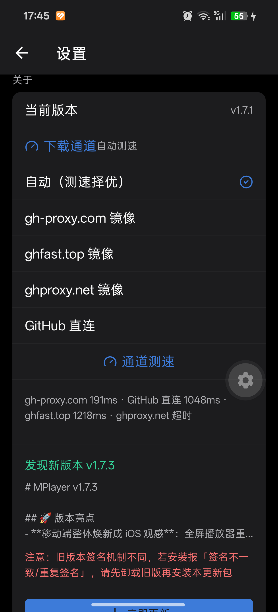

# 0011 · 应用更新镜像通道（桌面 + 移动端）

日期：2026-08-27 · 状态：已接受 · 关联：#262 #263 · 实现：PR #264

## 背景

GitHub 直连在国内不可靠，v1.7.x 更新链路出现三类故障：元数据检查超时（api.github.com / releases 直连）、APK/AppImage 大文件下载缓慢或失败、移动端升级被旧签名安装残留拒绝（debug→release keystore 断层，见 #263）。

## 决策

1. **镜像清单收敛 `@mplayer/core`（单一事实源）**：`gh-proxy.com → ghfast.top → ghproxy.net → GitHub 直连`（静态兜底顺序，直连垫底）。双端共用 `shared/updateChannels.ts` 的清单/探针/排序。
2. **auto 通道 = 延迟探针排序**：GET `latest.yml`（数百字节、发布必存在）并发测延迟，缓存 10 分钟；手动通道置顶所选源。
3. **大文件下载交给专职工具**：
   - 移动端：`Linking.openURL(镜像直链)`，浏览器下载管理器接管；
   - 桌面端：`shell.openExternal` 同构接管（electron-updater 保留检查与元数据职责，进程内单流下载对公共镜像波动无抵抗力——真机实测 ghfast 连接质量逐次抽奖，0% 停滞频发）。
4. **停滞自愈**：进程内下载路径保留（未来可做设置项），看门狗语义 = 首字节 25s / 进度停滞 30s / 持续推进不限时；停滞源会话内降权到队尾。
5. **签名断层运维**：release.keystore 一旦启用永久固定并须线下备份；跨签名升级（≤1.7.1 → ≥1.7.2）在更新 UI 显式提示卸载重装。

## 后果

- 更新 UX 与网络波动解耦：镜像波动只影响浏览器下载速度，不再出现应用内假死。
- 延迟探针 ≠ 吞吐（ghfast 实测低延迟限速大文件），已用停滞降权缓解；按吞吐采样测速列入后续优化（#262）。
- `syncProxyEnv` 未配置时钉死直连，系统代理（Clash 等）对更新器不可见；是否改为跟随系统代理待定。
- WSL2 dev 环境：Cloudflare 镜像诱导 Chromium 升级 QUIC(UDP 443)，镜像网络 UDP 转发不可靠导致下载 0% 停滞；dev 已 `disable-quic`（打包产物暂保持默认，待 Windows/mac 实测）。
- **产物名必须无空格（#350）**：electron-builder 写 `latest.yml` 时把空格换成 `-`（`MPlayer-Setup-1.8.1.exe`），而 `gh release upload` 上传的磁盘原名被 GitHub 规范成 `.`（`MPlayer.Setup.1.8.1.exe`）——Windows 默认产物模板带空格，三者分叉会让更新直链 404（v1.7.3–v1.8.1 全中，镜像只是把 GitHub 的 404 原样转发）。win 的 `nsis`/`portable` 已显式声明无空格 `artifactName`，保证磁盘名 = feed 名 = 资产名；改产物名模板前先看 `electron-builder.yml` 注释与 `src/__tests__/main/updateService.test.ts` 的一致性测试。

## 验收截图（移动端真机）

